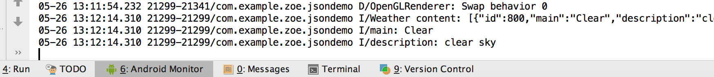
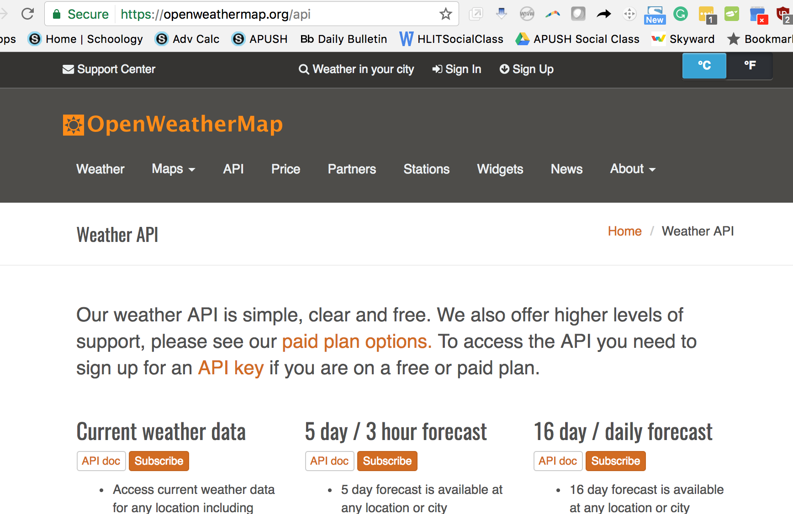
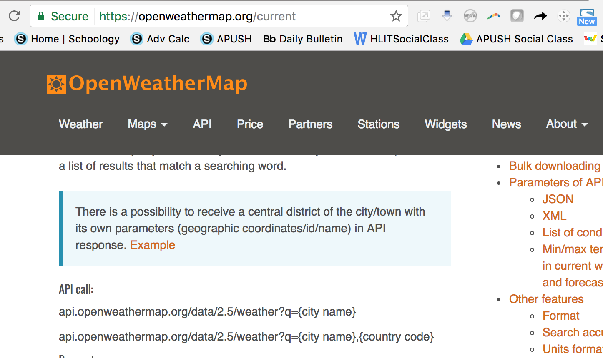
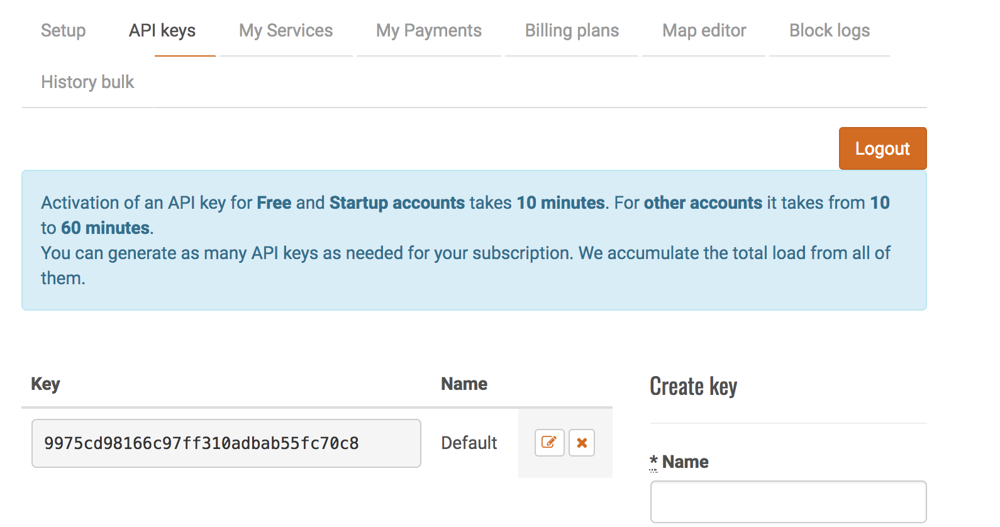

<h1>Loading JSON Data</h1>

<p>JSON, or Javascript Object Notation, is a format for structuring data.  It lets you send data to and retrive data from a web application.  In this tutorial, we will learn how to retrieve weather data from any location around the world.</p>

<br>
<br>




<br>
<br>
<p>First, go to <a>https://openweathermap.org/api</a>.  There are several options you can choose from, including 5 day forecasts, but today we'll find current weather data.  Click on "API doc"</p>
<br>
<br>

<br>
<br>
<p>Copy the API call </p>
api.openweathermap.org/data/2.5/weather?q={city name},{country code}
<p></p>


<br>
<br>

<p>Next, create an account with OpenWeatherMap to create your own API key.  After you've created an account, go to the "API keys" tab and find your API Key. </p>
<br>
<br>
<p></p>
<br>
<br>
<p>Next, create a new project.   I named my project "JSONDemo".  Open up MainActivity.java and enter the following code:

It's generally a good idea to run code that might take a while on a different thread than the main thread.  In this case, we'll be using AsyncTask to run code on a background thread.  

AsyncTask takes variables of type String, Void, and String.  The 1st variable (String) instructs the class what to do.  In this case, we'll be sending DownloadTask a URL to download.  This will be our call to the Open Weather Map API.

The 2nd variable (Void) is the name of the method to show the progress of the task.  We won't be using that today, though.  

The 3rd variable is the variable that will be returned.  

The "protected" keyword means the function can be accessed anywhere in the package, not just the class. 

The "String.... params" is more or less an array of Strings.
</p>

```
public class DownloadTask extends AsyncTask<String, Void, String> {

        @Override
        protected String doInBackground(String... urls) {

            
        }
```

<p>
<br>
<br>
First, we'll create an empty string to store our results.  Then, we'll create an empty URL to store our URL, and an empty urlConnection to store the urlConnection.  

Then, we'll take the first url given to us from our argument, the (String... urls) up top.  This could fail if it's not a valid URL, so we need to surround it with try/catch.  

Then, we'll set up a urlConnection with our url.  Again, this could fail, so we add a catch clause to our try/catch. 

Then, we add an InputStreamReader to read our input stream. 

Let's create a variable data that will read the data from the URL.  We will read each character from the data and append it to results.  </p>


```
            String result = "";
            URL url;
            HttpURLConnection urlConnection = null;

            try {
                url = new URL(urls[0]);

                urlConnection = (HttpURLConnection) url.openConnection();

                InputStream in = urlConnection.getInputStream();

                InputStreamReader reader = new InputStreamReader(in);

                int data = reader.read();

                while (data != -1) {

                    char current = (char) data;

                    result += current;

                    data = reader.read();

                }

                return result;

            } catch (MalformedURLException e) {
                e.printStackTrace();
            } catch (IOException e) {
                e.printStackTrace();
            }

            return null;
```

<br>
<h1></h1>

<p>Now, we need to create a jsonObject created from the result string.  If the result string is empty or there is a problem with the JSON, this code will fail, so we need to surround this with try/catch.  Once we have our jsonObject, we can extract particular parts from it.  We can use jsonObject.getString("weather") to extract the weather part of the JSON Object instead of extracting all the data the JSON gives us.  

To obtain more specific information, we first create a JSONArray from the weather info.  We loop through the array and convert each of the items in the array and make a new jsonObject from that part.  </p>


```
@Override
        protected void onPostExecute(String result) {
            super.onPostExecute(result);

            try {

                JSONObject jsonObject = new JSONObject(result);

                String weatherInfo = jsonObject.getString("weather");

                Log.i("Weather content", weatherInfo);

                JSONArray arr = new JSONArray(weatherInfo);

                for (int i = 0; i < arr.length(); i++) {

                    JSONObject jsonPart = arr.getJSONObject(i);

                    Log.i("main", jsonPart.getString("main"));
                    Log.i("description", jsonPart.getString("description"));

                }


            } catch (JSONException e) {
                e.printStackTrace();
            }


        }
```
<h1></h1>
<p>This is where you'll be using the url and API Key you found earlier. Fill in the url below with the city and country code of the place you want to find weather info for and input your API Key after.
"http://api.openweathermap.org/data/2.5/weather?q=[CITY],[COUNTRY CODE]&&APPID=[YOUR API KEY] </p>

<p>We first create a new instance of DownloadTask. We can then execute it using the API call.</p>

```
@Override
    protected void onCreate(Bundle savedInstanceState) {
        super.onCreate(savedInstanceState);
        setContentView(R.layout.activity_main);

        DownloadTask task = new DownloadTask();
        task.execute("http://api.openweathermap.org/data/2.5/weather?q=London,uk&&APPID=9975cd98166c97ff310adbab55fc70c8");

    }
```

<p>Next, in your AndroidManifest.xml file, be sure to include a line that gives you permission to access the internet in your app. </p>

```
 <uses-permission android:name="android.permission.INTERNET"
```

<p></p>

<h1></h1>

<p>Complete code for MainActivity.class is below:</p>


```
package com.example.zoe.jsondemo;

import android.app.Activity;
import android.os.AsyncTask;
import android.os.Bundle;
import android.util.Log;

import org.json.JSONArray;
import org.json.JSONException;
import org.json.JSONObject;

import java.io.IOException;
import java.io.InputStream;
import java.io.InputStreamReader;
import java.net.HttpURLConnection;
import java.net.MalformedURLException;
import java.net.URL;


public class MainActivity extends Activity {

    @Override
    protected void onCreate(Bundle savedInstanceState) {
        super.onCreate(savedInstanceState);
        setContentView(R.layout.activity_main);

        DownloadTask task = new DownloadTask();
        task.execute("http://api.openweathermap.org/data/2.5/weather?q=London,uk&&APPID=9975cd98166c97ff310adbab55fc70c8");

    }

    public class DownloadTask extends AsyncTask<String, Void, String> {

        @Override
        protected String doInBackground(String... urls) {

            String result = "";
            URL url;
            HttpURLConnection urlConnection = null;

            try {
                url = new URL(urls[0]);

                urlConnection = (HttpURLConnection) url.openConnection();

                InputStream in = urlConnection.getInputStream();

                InputStreamReader reader = new InputStreamReader(in);

                int data = reader.read();

                while (data != -1) {

                    char current = (char) data;

                    result += current;

                    data = reader.read();

                }

                return result;

            } catch (MalformedURLException e) {
                e.printStackTrace();
            } catch (IOException e) {
                e.printStackTrace();
            }

            return null;
        }

        @Override
        protected void onPostExecute(String result) {
            super.onPostExecute(result);

            try {

                JSONObject jsonObject = new JSONObject(result);

                String weatherInfo = jsonObject.getString("weather");

                Log.i("Weather content", weatherInfo);

                JSONArray arr = new JSONArray(weatherInfo);

                for (int i = 0; i < arr.length(); i++) {

                    JSONObject jsonPart = arr.getJSONObject(i);

                    Log.i("main", jsonPart.getString("main"));
                    Log.i("description", jsonPart.getString("description"));

                }


            } catch (JSONException e) {
                e.printStackTrace();
            }


        }
    }


}

```

<p></p>


